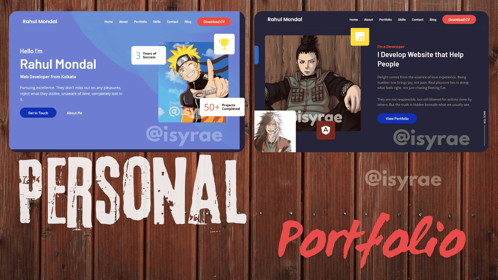

isyrae – Personal Portfolio Website
===================================

A fully responsive and elegant personal portfolio website by Rahul Mondal, created under the brand isyrae.
Built with HTML, CSS, and JavaScript. Responsive across all devices.

📸 Preview
--------------

🚀 Features
-----------
- Clean and modern UI
- Fully responsive design
- Easy to customize
- Smooth scroll & animations

🛠️ Getting Started
------------------

### Prerequisites
- Git: https://git-scm.com/downloads

### Run Locally

Clone the project:

    git clone https://github.com/isyrae/personal-portfolio.git
    cd personal-portfolio

Then open index.html in your browser.

✨ Customization
----------------
Feel free to edit:
- index.html for content
- style.css for design
- script.js for interactivity

Replace images inside ./assets/images/ as needed.

📞 Contact
----------
Want to connect? Reach out at https://instagram.com/igofrahul or DM on Telegram: https://t.me/isyrae

📄 License
----------
This project is licensed under the MIT License.
Feel free to use, modify, and share it with credit.
